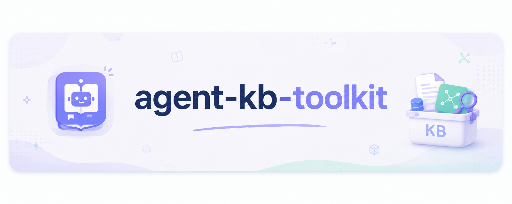
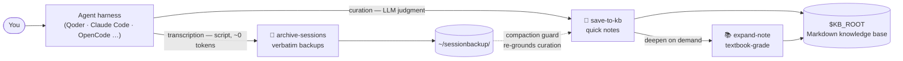

<div align="center">



# 🧰 agent-kb-toolkit

**Turn any coding-agent harness into a disciplined personal knowledge-base builder.**

Plain Markdown in → curated, textbook-grade notes out. No vector database required.

[](https://github.com/Criss404/agent-kb-toolkit/actions/workflows/validate.yml)
[](LICENSE)
[](#-quick-start)
[](https://agentskills.io)
[](#-portability)
[](#-contributing)

**English** · [简体中文](README.zh-CN.md)

</div>

---

**agent-kb-toolkit** is a set of three `SKILL.md` skills that teach your coding agent (Qoder, Claude Code, OpenCode, …) to maintain a personal knowledge base the way a disciplined librarian would: conversations get distilled into properly formatted, deduplicated, source-cited notes; any note can be deepened into textbook-grade study material; and every raw session is backed up verbatim by a zero-token script. It runs on any plain Markdown folder — an Obsidian vault is perfect — with **no vector database, no embedding API, no framework**.

## ⚡ Features

- 📝 **Conversation → clean notes, one sentence** — MOC-indexed, wiki-linked, source-labelled, following a written standard (Diátaxis types, terminology and typography rules)
- 🔍 **Write-time dedup** — a script shortlists related notes first, so recording cost stays `O(candidates)`, not `O(knowledge base)`
- 📚 **Textbook mode** — deepen any note with principles, examples & counter-examples, FAQ and self-tests, grounded in multi-source web research
- 💾 **Zero-token verbatim backups** — every session archived to Markdown by a plain script; immune to context compaction
- 🧩 **Self-extending** — unknown harness? The skill guides the agent to write and register a new adapter by itself
- 🔒 **Consent-first automation** — hooks install only after showing you the exact config snippet

## ✨ Why this exists

Knowledge work with an agent is really **two different jobs** that most tools conflate:

|  | Curation(策展) | Transcription(转录) |
|---|---|---|
| What | *Judge* what matters, write it up properly | *Mechanically* copy sessions verbatim |
| Who should do it | LLM (judgment required) | Script (determinism required) |
| Token cost | Worth paying | **~0** |

This toolkit keeps them separate, following one rule everywhere:

> **Rules → Memory · Workflows → Skills · Deterministic work → scripts · Inevitable events → Hooks.**

Backups and dedup search run as plain Python scripts (zero tokens, verbatim-faithful). Only the parts that genuinely need judgment run as LLM skills.

## 🧩 The three skills

| Skill | Line | What it does | Cost |
|---|---|---|---|
| 📝 **save-to-kb** | curation · quick | Curate a conversation into properly-formatted notes — write-time dedup, MOC index upkeep, compaction-safe | low |
| 📚 **expand-note** | curation · deep | Deepen one note into **textbook-grade** content (principles, examples & counter-examples, FAQ, self-test) via multi-source web research | high |
| 💾 **archive-sessions** | transcription | Verbatim-export every session transcript to Markdown backups — self-extending adapters, self-installing hooks | **~0 tokens** |

## 🏗️ How it works



Design details baked in:

- **Write-time dedup** — a script shortlists candidate notes first, so recording cost stays `O(candidates)`, not `O(knowledge base)`.
- **Compaction guard** — when context was compacted, curation re-grounds itself against on-disk transcripts instead of trusting compressed memory.
- **Self-extending** — meets an unknown harness? The skill guides the agent to write a new adapter and register it.
- **Self-installing hooks** — per-harness auto-backup recipes ship inside the skill, installed **only after showing you the exact config and getting your confirmation**.

## 🚀 Quick start

**Requirements:** Python 3.8+ (stdlib only), any harness that loads `SKILL.md` skills, a Markdown knowledge base (e.g. an Obsidian vault).

**1 — Get the skills**

One-liner (auto-detects your installed harnesses):

```bash
npx skills add Criss404/agent-kb-toolkit
```

<details>
<summary>Or install manually (clone + symlink)</summary>

```bash
git clone https://github.com/Criss404/agent-kb-toolkit.git
```

Symlink the skills into wherever your harness loads skills from:

| Harness | Skills directory |
|---|---|
| Claude Code | `~/.claude/skills/` |
| Qoder | `~/.qoder/skills/` |
| OpenCode | see [Agent Skills docs](https://opencode.ai/docs/skills/) |
| Shared (multiple harnesses) | `~/.agents/skills/` |

```bash
# example — Claude Code:
mkdir -p ~/.claude/skills
ln -s "$PWD/agent-kb-toolkit/skills/"* ~/.claude/skills/
```

</details>

**2 — Point at your knowledge base** (shell profile or your harness's `AGENTS.md`)

```bash
export KB_ROOT="/path/to/your/knowledge-base"
```

**3 — Talk to your agent**

| Say | Get |
|---|---|
| `save to kb` / `记录本次会话` | this session curated into notes |
| `expand note X` / `深化某篇笔记` | note upgraded to textbook grade |
| `archive sessions` / `备份会话` | verbatim transcript backups |

Optional: auto-backup on session end — see [`hook-recipes.md`](skills/archive-sessions/references/hook-recipes.md).

## 🔒 Security model

`archive-sessions` can install a session-end hook into your harness config (the *self-install protocol*). By design it is **idempotent** and **never writes silently** — it must show you the exact snippet and get your confirmation first. Config mutation is a known persistence vector; hold *any* skill that touches your config to this standard.

## 🌍 Portability

- **Memory / Skill** formats are near-standard across harnesses. **Hooks are not** — Qoder & Claude Code share a shell-hook schema, OpenCode uses a JS plugin, Codex differs again. Per-harness recipes are provided, plus a fallback protocol for unknown harnesses.
- Harness-specific paths and event names are deliberately *not* hardcoded — the skills tell the agent to consult the harness's own docs, because that knowledge goes stale monthly.

## 🤝 Contributing

Issues and PRs welcome — especially new harness adapters for `archive-sessions`. See **[CONTRIBUTING.md](CONTRIBUTING.md)** for the SKILL.md structure, frontmatter rules, and the three-step adapter recipe.

## 📄 License

[MIT](LICENSE) © 2026 Criss404
