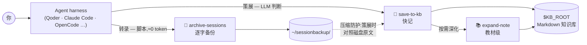

<div align="center">


# 🧰 agent-kb-toolkit

**把任意 coding-agent harness 变成纪律严明的个人知识库工具链。**

输入是普通 Markdown 目录 → 输出是经过策展、教材级的笔记。起步无需向量库。

[](https://github.com/Criss404/agent-kb-toolkit/actions/workflows/validate.yml)
[](LICENSE)
[](#-快速开始)
[](https://agentskills.io)
[](#-可移植性)
[](#-参与贡献)

[English](README.md) · **简体中文**

</div>

---

**agent-kb-toolkit** 是三个 `SKILL.md` skill 的组合,教会你的 coding agent(Qoder、Claude Code、OpenCode…)像一位纪律严明的图书管理员那样维护个人知识库:对话被提炼成格式规范、查重去重、标注来源的笔记;任何一篇笔记都能深化成教材级学习材料;每场原始会话由零 token 脚本逐字备份。它直接运行在普通 Markdown 目录上——Obsidian 仓库就很完美——**不需要向量库、不需要 embedding API、不需要任何框架**。

## ⚡ 功能特性

- 📝 **一句话把对话变成规范笔记**——MOC 索引、wiki 互链、来源标注,遵循成文的写作规范(Diátaxis 类型、术语与排版约定)
- 🔍 **写前查重**——脚本先筛出相关候选笔记,记录成本保持 `O(候选)` 而非 `O(全库)`
- 📚 **教材模式**——把任意笔记深化为含原理展开、示例与反例、误区 FAQ、自测题的深度内容,基于多来源联网研究
- 💾 **零 token 逐字备份**——每场会话由纯脚本归档为 Markdown,不受上下文压缩影响
- 🧩 **自扩展**——遇到未知 harness?skill 会引导 agent 自己写适配器并注册
- 🔒 **先确认再自动化**——hook 必须先展示确切配置片段、经你同意才写入

## ✨ 设计理念

用 agent 做知识管理,其实是**两件常被混为一谈的事**:

|  | 策展(Curation) | 转录(Transcription) |
|---|---|---|
| 做什么 | **判断**什么值得记,按规范写成笔记 | **机械地**逐字备份会话原文 |
| 该由谁做 | LLM(需要判断力) | 脚本(需要确定性) |
| Token 成本 | 值得花 | **≈0** |

本工具包把两条线严格分开,并处处遵循同一条口诀:

> **一句话约定进 Memory,多步流程进 Skill,机械活写脚本,必然发生挂 Hook。**

备份与查重检索都是纯 Python 脚本(零 token、逐字保真);只有真正需要判断的部分才交给 LLM skill。

## 🧩 三个 Skill

| Skill | 线路 | 职责 | 成本 |
|---|---|---|---|
| 📝 **save-to-kb** | 策展 · 快记 | 把会话策展成规范笔记——写前查重、MOC 索引维护、压缩防护 | 低 |
| 📚 **expand-note** | 策展 · 深化 | 把一篇笔记通过多来源联网研究深化为**教材级**内容(原理展开、示例与反例、误区 FAQ、自测题) | 高 |
| 💾 **archive-sessions** | 转录 | 逐字导出各 harness 的会话记录为 Markdown 备份——自扩展适配器、自安装 hook | **≈0 token** |

## 🏗️ 工作原理



内建的设计细节:

- **写前查重**——脚本先筛出候选笔记,记录成本保持 `O(候选)` 而非 `O(全库)`;
- **压缩防护**——上下文被压缩后,策展会对照磁盘转录本核对细节,而不是轻信被压缩的记忆;
- **自扩展**——遇到未知 harness?skill 会引导 agent 自己写适配器并注册;
- **自安装 hook**——各家的自动备份配方随 skill 分发,但**必须先展示配置片段、经你确认才写入**。

## 🚀 快速开始

**环境要求**:Python 3.8+(仅标准库)、任意支持 `SKILL.md` 的 harness、一个 Markdown 知识库目录(如 Obsidian 仓库)。

**1 — 获取**

一行命令(自动探测你装了哪些 harness):

```bash
npx skills add Criss404/agent-kb-toolkit
```

<details>
<summary>或手动安装(clone + 软链接)</summary>

```bash
git clone https://github.com/Criss404/agent-kb-toolkit.git
mkdir -p ~/.agents/skills
ln -s "$PWD/agent-kb-toolkit/skills/"* ~/.agents/skills/
# 各家专属位置:  ~/.claude/skills/   ~/.qoder/skills/
```

</details>

**2 — 指向你的知识库**(写进 shell 配置或 harness 的 `AGENTS.md`)

```bash
export KB_ROOT="/path/to/your/knowledge-base"
```

**3 — 直接对 agent 说话**

| 你说 | 得到 |
|---|---|
| `记录本次会话` / `save to kb` | 本次会话被策展成规范笔记 |
| `深化某篇笔记` / `expand note X` | 笔记升级为教材级 |
| `备份会话` / `archive sessions` | 会话逐字备份 |

可选:退出时自动备份——见 [`hook-recipes.md`](skills/archive-sessions/references/hook-recipes.md)。

## 🔒 安全模型

`archive-sessions` 可以把"会话结束自动备份"的 hook 写进 harness 配置(自安装协议)。设计上它**幂等**且**绝不静默写入**——必须先向你展示确切的配置片段并获得确认。修改 agent 配置是已知的持久化攻击载体;对**任何**要动你配置的 skill,都应以同样标准要求。

## 🌍 可移植性

- **Memory / Skill** 格式在各 harness 间已接近标准;**Hook 没有标准**——Qoder 与 Claude Code 同族,OpenCode 走 JS plugin,Codex 又是一套。工具包内置各家配方 + 未知 harness 的兜底协议。
- 各家的路径、事件名**刻意不硬编码**——skill 会引导 agent 查阅该 harness 自己的文档,因为这类产品层知识按月过时。

## 🤝 参与贡献

欢迎 Issue 和 PR——尤其欢迎为 `archive-sessions` 添加新 harness 适配器([`archive_sessions.py`](skills/archive-sessions/scripts/archive_sessions.py) 内的 `ADAPTER REGISTRY` 注释给出了三步接入法)。

## 📄 许可证

[MIT](LICENSE) © 2026 Criss404
